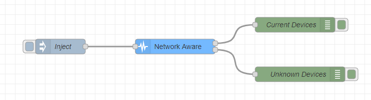

# Changelog

All notable changes to this project will be documented in this file.

## Sprint 4 (02/12/2020 - 04/01/2021)

#### Increment description

The main functionalities added are:

- Redundancy Manager, a node that keeps redundant Node-RED instances informed of each other and elects a master instance based on the ip. These instances run on different machines on the same local network, and the node checks when new instances come online or go offline, and through a bully algorithm selects an instance to be in control. Controls are provided for the ping interval (to check known instances are alive and inform them we are alive) and for the timeout threshold (to decided if an instance went too long without sending a ping).

- HTTP Aware, a node to continuously ping all IP adresses, in a network picked by the user, through the most commonly used ports (80, 8080 and 443). An instance of the node goes through all IPs of the network according to the net mask given, and after pinging to each of those IP's for each port through a socket, if the connection is successfully established then the correspondent IP:port is sent through the output. An example flow and edit controls are:

### Week of 30/12/2020 - 04/01/2021

#### Added

- Added unit tests and documentation for the Redundancy node #37
- Added HTTP Aware node #76

### Week of 23/12/2020 - 29/12/2020

No progress because of Christmas

### Week of 16/12/2020 - 22/12/2020

#### Changed

- Refactored the Redundancy node #37

## Sprint 3 (11/11/2020 - 01/12/2020)

#### Increment description

The main functionalities added are:

- Action audit, a node that validates each action issued, making sure each is triggered when needed. After the audit, it then waits for an acknowledgment message, to confirm the occurrence of that action (for example from a sensor that checks the actuator's effect). If the waiting period exceeds a given limit, then an error is triggered. To circumvent node-red's limit of one input per node, actions and acknowledgments should be passed through 'change' nodes, labeling them accordingly (as ACTION and ACK, respectively). Here is a usage example:

- Network Aware, a node that scans the network at every determined interval by finding all devices present in the given network using the ARP table. Each device scanned can be valid or not, depending on its MAC address and all device's information is sent afterwards. An example flow and edit controls are:

- Heartbeat, a node that helps in making sure that MQTT and HTTP connections are alive, by periodically scanning them and checking their activity. This node uses two distinct methods: a "passive" one, where an inject node must be connected to an MQTT out/HTTP request node and Heartbeat must receive a message from its input node, MQTT/HTTP in at most "frequency" seconds; and an "active" one where the node sends a message directly to an MQTT out/HTTP node that must be received back with less than "delay" seconds.

### Week of 25/11/2020 - 01/12/2020

#### Added

- Action Audit node, with unit, property-based and acceptance tests #69
- Heartbeat node #56
- Acceptance tests for threshold-check, timing-check, resource-monitor, flow-control, balancing, replication-voter #71
- Network Aware node #34
- Added important Sentry entries for the following nodes: Timing check, Action audit, Threshold check, Flow control and Resource monitor.

### Week of 18/11/2020 - 24/11/2020

No progress

### Week of 11/11/2020 - 17/11/2020

No progress

## Sprint 2 (21/10/2020 - 10/11/2020)

### Week of 04/11/2020 - 10/11/2020

#### Added

- Added Property Based Tests with JSVerify for bounded-stack, used with bounded-stack node. #66
- Added JSONSchema for each of the node's input/outputs. #63
- Added Sonarqube Integration #65
- Added Sentry Integration, with the option of not using it on production #62
- Added Checkpoint node #61
- Added acceptance testing using selenium #67
- Action Delay/Debounce: add tests for the following strategies: first, last and allByOder. Changed the name and functionality of action delay to debounce. #55 #18
- Added Resource Monitor node #59

#### Changed

- Enhancement of Timing Check node by adding a sliding window and determining the average of periods between
  consecutive messages, which allows achieving a more concise conclusion about the general flow. Sliding window
  size can be defined in the node's settings. #57
- Action Delay: refactor discard strategy test #55
- Enhancement of Replication Voter node by adding the possibility of using strings and using a margin when calculating the majority value.

### Week of 28/10/2020 - 03/11/2020

#### Added

- Readings Watcher: add a pair of buttons ("percentile" and "fixed") to the node's UI that functions as a switch.
  Based on which mode is selected, a "percentile" or "fixed" change is calculated and compare to the threshold
  values defined for minimum/maximum change.
  Also refactors the old tests and adds new ones for the "fixed" mode. #58
- Action Delay: added margin for the delay. #55

#### Changed

- Rebuilt pipelines to focus on merge requests and protected branches #53
- Refactored node Action Delay #55

### Week of 21/10/2020 - 27/10/2020

## Sprint 1 (07/10/2020 - 20/10/2020)

### Week of 13/10/2020 - 20/10/2020

#### Added

- Node Balancing #41
- Set up integration with upstream GitHub repository #44
- Code coverage analysis #46
- Mutation testing #47
- Unit tests for every node

#### Changed

- Refactored node Threshold Check #30
- Refactored node Heartbeat #29
- Refactored node Readings Watcher #32
- Refactored node Replication Voter #35
- Refactored node Flow Control #36
- Refactored node Kalman Noise Filter #38
- Refactored node Timing Check #33
- Refactored node Action Delay #31

#### Security

- SAST Integration #48

### Week of 06/10/2020 - 12/10/2020

#### Added

- Format checking pipeline job #43
- Unit testing pipeline job #42

## Sprint 0 (29/10/2020 - 06/10/2020)

### Week of 29/10/2020 - 06/10/2020

#### Added

- Cloned repository from PO
- README.md
- CHANGELOG.md
