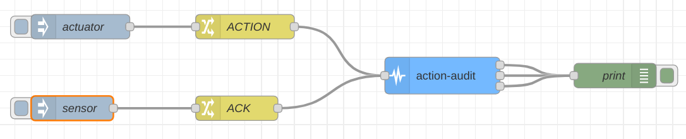

### Objective

A node that checks if an action was completed

### Details

The purpose of this node is to confirm an action performed by an actuator, in a given time frame, by the use of acknowledgements provided by sensors that can confirm the occurence of that action. If an action is sent to the node, and an acknowledgement is sent during a given time to live, then the node concludes that the action was successful. Otherwise, an error message is sent.

### Properties

<dl class="message-properties">

<dt>name: string</dt>

<dd>name of node to be displayed in editor</dd>

<dt>duration: integer</dt>

<dd>An action's max duration to be checked on, in seconds</dd>

</dl>

### Inputs

<dl class="message-properties">
A message should have exactly one of the following properties:

<dt>action</dt>

<dd>The description of an action or any data for a given action</dd>

<dt>ack</dt>

<dd>
    An aknowledgement to the action that was sent first and still not
    acknowledged
</dd>

</dl>

### Outputs

<dl class="message-properties">If the first queued action is acknowledged, then it's retransmitted through the success output, otherwise it's retransmitted through the error output. In case of an unexpected situation, such as a receiving an ACK with no queued actions, it's sent through a third exception output.</dl>

### Example Flow

