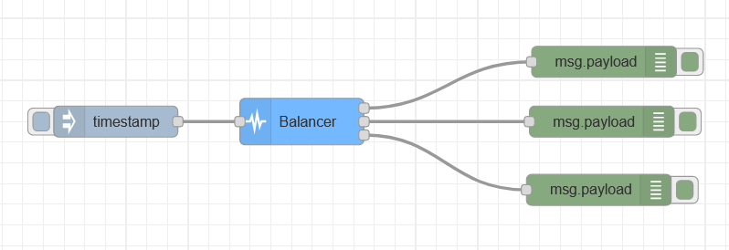

### Objective

This node is used to balance the distribution of messages through multiple outputs.

### Details

  The balancing node provides a way of balancing message traffic through
  multiple flows in order to avoid the overloading of some nodes while others
  are left idle.

  When a message arrives, the node will run the selected algorithm and decide
  to which output it will send the receive message.

### Properties

<dl class="message-properties">
    <dt>
      name
      string
    </dt>
    <dd>name of node to be displayed in editor</dd>
    <dt>outputs</dt>
    <dd>number of outputs of the node</dd>
    <dt>algorithm</dt>
    <dd>distribution algorithm to be implemented inside the node</dd>
    <dt>weights</dt>
    <dd>
      if the Weighted Round Robin algorithm is chosen, each row represents the
      weight associated to each output
    </dd>
  </dl>

### Inputs

<dl class="message-properties">Any type of message</dl>

### Outputs

<dl class="message-properties">Input message is passed unchanged to only one of the outputs.</dl>

### Example Flow

