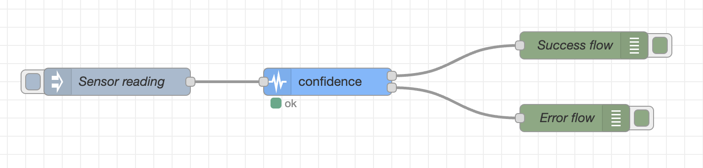

### Objective

A node that tags a sensor reading with a confidence level.

### Details

This node can be placed right after an "mqtt in" node subscribed to a topic for a given sensor's readings. The node receives an absolute measurement uncertainty, normally issued by the sensor's manufacturer, as an initial parameter. This uncertainty, in conjunction with the current reading value, is used to calculate the relative measurement uncertainty. This value is then subtracted to 100% to calculate the confidence level. Note that this node is not very useful with sensors that produce readings close to 0, since the relative measurement goes to infinity as the values tend to null.

### Properties

<dl class="message-properties">
    
<dt>name: string</dt>

<dd>name of node to be displayed in editor</dd>

<dt>measurement uncertainty: integer</dt>
    
<dd>the sensor's absolute measurement uncertainty, in the same unit as the sensor readings </dd>
  
</dl>

### Inputs

<dl class="message-properties">Any input in which the payload is a number</dl>

### Outputs

<dl class="message-properties">Equal to the last message object sent as input but with an additional <b>confidence</b> field, containing the calculated confidence level, in percentage </dl>

### Example Flow

