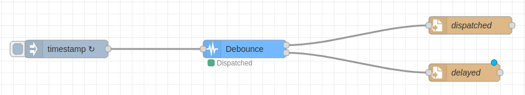

A node to delay actions or messages in order to avoid overload

## Details

This node can be used to delay a command (message) in order to meet the actuator response capacity.

## The following strategies can be applied:

<dl>
  <dt><b>discard</b></dt>
  <dd>discards the delayed message</dd>
  <dt><b>first</b></dt>
  <dd>sends the first delayed message</dd>
  <dt><b>last</b></dt>
  <dd>sends the last delayed message</dd>
  <dt><b>allByOrder</b></dt>
  <dd>sends all delayed messages</dd>
</dl>

## Inputs

<dl>
  
Any type of message

</dl>

## Outputs

<dl>
  <dt><b>Execute</b></dt>
  <dd>Messages that are being sent within the allowed response capacity</dd>
  <dt><b>Delayed</b></dt>
  <dd>Messages that are overloading the response capacity</dd>
</dl>

## Example Flow

