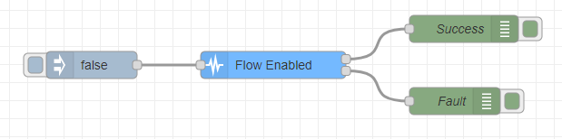

### Objective

This node keeps track of all the online devices and their information.

### Details

All the devices that are reachable can communicate with this device in order to store their information and current state.

### Inputs

    <b>Device List:</b> The input should be a list containing the information of the
    devices to register/update

### Outputs

    <b>Device list:</b> This output shows the list containing all of the registered
    devices and their information.

    <b>Registered new device:</b> This output shows the information of a newly
    registered device.

    <b>Removed device:</b> This output shows the information of a device that was
    recently removed from the system.

### Example Flow

