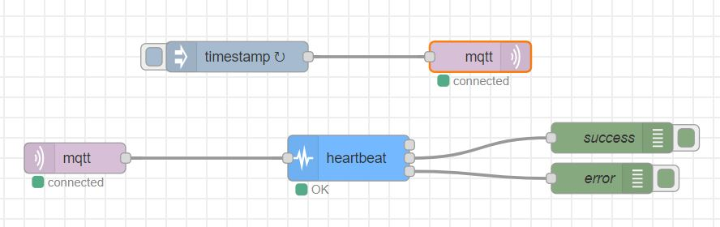

### Objective

A node that provides a heartbeat probe for the HTTP and MQTT communication protocols.

### Details

This node has two different methods of verifying if a connection is alive or not, either "passive" or "active".

The "passive" option requires both an "inject" node (repeating periodically) connected to an "MQTT out" node, and an "MQTT in" node connected as input for Heartbeat. The user must select the same topic for both these nodes. If a connection was established successfully within "frequency" seconds (the heart "beat" defined by the user), then the node signals "OK". Otherwise, it signals "FAIL".

The "active" option requires both the "MQTT in" node as input and the "MQTT out" as the first output, configured with the same topic. Heartbeat will send a message to the "MQTT out" node and, if a connection is established and the message was received back at "MQTT in" node after, at most, "delay" seconds (chosen by the user), then the node signals "OK". Otherwise, it signals "FAIL".

For example, if "frequency" is 10 seconds and "delay" 5 seconds, in "passive", a message must be received at least once within those 10 seconds. In "active", the message cannot, within those 10 seconds, take more than 5 seconds to arrive.

The same logic is used for the HTTP protocol, using the "HTTP in" and "HTTP request", configured with the same URLs.
The second and third outputs represent "success" and "error" routes respectively. The user can connect "debug" nodes to check the messages received.

### Properties

<dt>frequency</dt>

time interval for the heartbeats, in seconds

<dt>protocol</dt>

heartbeat protocol, either active or passive. This property defines the way the node will check for a live connection. If active is chosen, this node will check for a connection, within the frequency chosen, to be established at max in a certain delay (in seconds), which must be specified. If passive is chosen, this node will check for a connection to be established within the frequency chosen

<dt>onfail</dt>

if checked, only sends a message if an error occurs

<dt>delay</dt>

used for "active" protocols

<h3>Inputs</h3>

Depending on the protocol to be tested, a "HTTP in" or "MQTT in" node must be provided.

<h3>Outputs</h3>

First output is used for sending a message into "MQTT out"/"HTTP request" nodes in "active" verifications.
Error message when an error occured (third output), or a success message (second output), if the user did not select the "Only send msg on fail" checkbox.

### Example Flow

#### Active MQTT

#### Active HTTP

#### Passive MQTT

#### Passive HTTP

