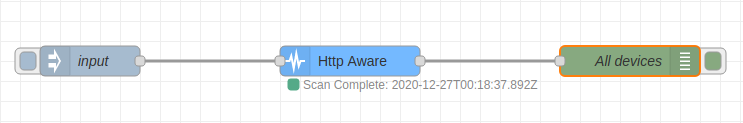

### Objective

A node to continuously scan the network to find working IPs at ports 8080,
443 and 80.

### Properties

  <dl class="message-properties">
    <dt>name: string</dt>
    <dd>Name of node to be displayed in editor.</dd>
    <dt>baseip: string</dt>
    <dd>Network IP to be scanned.</dd>
    <dt>scanInterval: number</dt>
    <dd>Time interval between scans, in seconds.</dd>
  </dl>

### Inputs

  <dl class="message-properties">
    
Any message.

  </dl>

  <h3>Outputs</h3>
  <dl class="message-properties">
    
If an IP:port is up, it sends a message.

  </dl>

### Details

  
Scans all the IPs of the given subnetwork and checks if they are up.

### Example Flow

