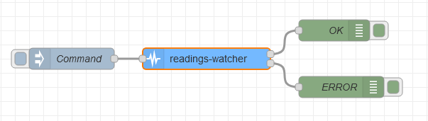

### Objective

A node to check if sequencial readings are within expected parameters, using
different verification methods.

### Details

When placed after a sensor for example, this node keeps track of consecutive readings, and checks if they respect the following configurable strategies:

- Minimum change: will trigger an error if the difference between two consecutive readings is <code>lower</code> than the specified limit.
- Maximum change: will do the same if the difference is <code>higher</code> than the limit.
- Stuck at: will compare the last <code>X</code> readings and trigger an error if they are all the same value.

Values can be interpreted as percentile or fixed. Two consecutive readings of <code>10</code> and <code>15</code> have a <code>0.5 "percentile change</code> or a <code>5 "fixed" change</code>

If the <code>payload</code> is not a <code>number</code>, no message is sent and an error is called with <code>done(error)</code>.

Conforment readings will be forwarded to the <code>OK</code> output.  
When an error is triggered, the message is redirected to the <code>ERROR</code> output.

When the node is finished with a message, <code>done()</code> is called, so any <code>complete</code> nodes can receive a message about it. Likewise for <code>done(err)</code> and any <code>catch</code> nodes if any error happens.

### Setup

- Enable strategies to limit consecutive readings. When enabled, a corresponding property will appear in the <code>Values</code> section (they can be used simultaneously).
- Set the threshold values.
- Choose if the values set represent percentile or fixed thresholds.

### Properties

<dt>name: string</dt>

  <dd>name of node to be displayed in editor</dd>

  <dt>toggles: checkbox</dt>
  <dd>checkboxes to enable/disable the verification methods available</dd>

  <dt>valueType: button</dt>
  <dd>
      Toggleable buttons to choose between percentile or fixed change
      calculation
  </dd>

  <dt>minchange: number</dt>
  <dd>Minimum change allowed between consecutive readings</dd>

  <dt>maxchange: number</dt>
  <dd>Maximum change allowed between consecutive readings</dd>

  <dt>stucklimit: number</dt>
  <dd>Number of equal value readings allowed before triggering error</dd>

### Inputs

A message containing a <code>payload</code> property with a <code>number</code> is required  
{ "payload":10 }

### Outputs

A <code>timestamp</code> is added to the message (or updated if it exists already).  
If reading is within expected parameters, message is forwarded to the <code>OK</code> output  
{ "payload": 10, "timestamp": 1604141914614 }  
Otherwise, it is sent through <code>ERROR</code> output and a <code>type</code> is added to show which verification failed  
{ "payload": 10, "timestamp": 1604141914614, "type": "minchange" }

### Example Flow

