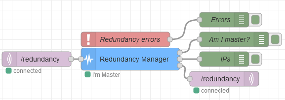

### Objective

A node that manages redundant instances of Node-RED (setting a master instance).
Works only on the local network (uses mqqt communication).

### Details

This node can be placed in a given flow, connected to two mqtt nodes: one for input
and another one for output.

The mqtt nodes will be used to elect a mater instance of the several redundancy nodes
(properly connected to two mqtt nodes in the same way). For this, the bully election
algorithm will be used, prioritizing the IP address with the largest last octet.

Each node will send as output an objet with the property "master" set as true or false,
in order to enable or disable certain flows, depending on whether it was elected as master
or not.

### Setup

In order for the redundancy node to work properly, it must connect to two mqtt nodes:
one for the input ("mqtt"), an mqtt-in, and another for the third output ("ping"),
an mqtt-out.

### Properties

<dl class="message-properties">
  <dt>namestring</dt>
  <dd>name of node to be displayed in editor</dd>

  <dt>pingIntervalinteger</dt>
  <dd>ping interval to the mqtt-out, in seconds</dd>

  <dt>timeoutinteger</dt>
  <dd>connection timeout, in seconds</dd>
</dl>

### Inputs

<dl class="message-properties">
  
An mqtt-in node for a given topic

</dl>

### Outputs

<dl class="message-properties">
  
Equal to the last message sent as input 

  <dt>master(bool)</dt>
  <dd>if the redundancy-manager node is the master instance or not</dd>

  <dt>ips(array)</dt>
  <dd>an array containing the ip addresses of other deviced with redundancy-manager nodes</dd>

  <dt>ping</dt>
  <dd>ping for the output mqtt-out node</dd>
</dl>

### Example Flow

