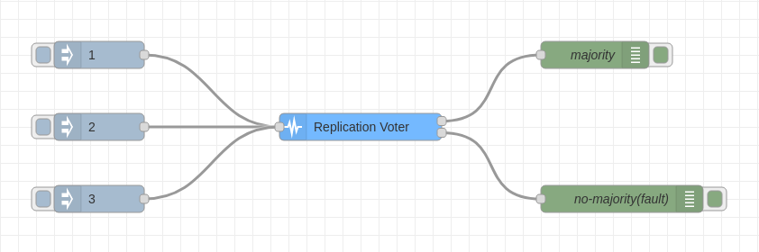

A node to check what is the majority value.

  <h3>Properties</h3>
  <dl class="message-properties">
    <dt>
      name
      - string
    </dt>
    <dd>name of node to be displayed in editor</dd>
    <dt>input type</dt>
    <dd>input can be a number, a string or an array of numbers and strings</dd>
    <dt>majority value - number</dt>
    <dd>number of similar values required to have a majority</dd>
    <dt>number of expected inputs - number</dt>
    <dd>total number of inputs where the majority will be checked</dd>
    <dt>margin - number</dt>
    <dd>percentage of margin considered when calculating the majority</dd>
    <dt>result type</dt>
    <dd>
      when there is a margin different than 0, the result can be the mean value,
      the highest value or the lowest value
    </dd>
  </dl>
  <h3>Inputs</h3>
  <dl class="message-properties">
    <dt>
      payload
      - number | string | array&ltnumber&gt | array&ltstring&gt
    </dt>
    <dd>number, string or array</dd>
  </dl>
  <h3>Outputs</h3>
  <dl class="message-properties">
    <dt>
      payload
      - number | string
    </dt>
    <dd>if there is a majority, then the output is the majority value</dd>
    <dd>
      if not, the output is equal to the first input or the result type of the
      interval with the most inputs, if there is a margin
    </dd>
  </dl>
  <h3>Details</h3>
  

    If the input is a number or a string, the node will check the majority every
    time it receives the number of expected inputs. It will only count inputs of
    the same type as the input type option. If there is a number or a string
    that is received equal or more times than the majority value, then this
    number is the majority. If not, there is no majority.
  

  

    If the input is an array, the node will check if there is a number or string
    (depends on the input type chosen) on the array that is duplicated equal or
    more times than the majority value. If so, this number or string is the
    majority, and if not, there is no majority.
  

  

    If there is a margin, this margin will be taken into account when checking
    the majority. Values within the margin of a number will count as equal to
    it. The output will be equal to the result type of the interval with the
    most values.
  

  

    If there are two or more numbers or strings (depends on the input type
    chosen) that appear equal or more times than the majority value, the
    majority will be the number or string that appears more times.
  

### Example Flow

