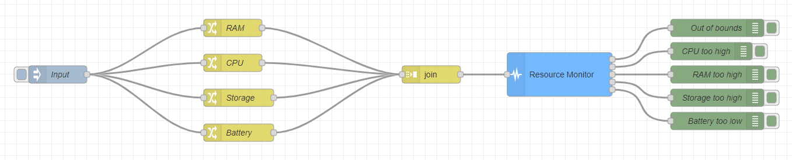

### Objective

A node to monitor system resources, ranging from battery levels to resources
usage.

### Details

### Properties

<dt>name: string</dt>
<dd>Name of node to be displayed in editor.</dd>
<dt>toggles: checkbox</dt>
<dd>
  Checkboxes to enable/disable the monitoring of the resources available.
</dd>

<dt>maxCPU: number</dt>
<dd>Maximum % of CPU usage allowed.</dd>

<dt>maxRAM: number</dt>
<dd>Maximum % of RAM usage allowed.</dd>

<dt>maxStorage: number</dt>
<dd>Maximum % of storage usage allowed.</dd>

<dt>minBattery: number</dt>
<dd>Minimum % of battery level allowed.</dd>

### Inputs

<dl>

    A message containing a <code>payload</code> property with a
    <code>JSON object</code> is required.

</dl>

### Outputs

<dl>

    If at least one resource isn't within expected limits, a message is sent
    through the corresponding resource(s) output(s).

    Besides that, a message is also sent through
    <code>resource(s) out of bounds</code> output and a
    <code>msg.type</code> is added to show which resource(s) exceeded the
    limits.

</dl>

### Details

Different resources can be enabled to be monitored. When enabled, a
corresponding property will appear in the section to select its limit usage.

<code>maxCPU</code> will trigger a message if CPU usage received is higher
than the specified limit.

<code>maxRAM</code> will trigger a message if RAM usage received is higher
than the specified limit.

<code>maxStorage</code> will trigger a message if storage usage received is
higher than the specified limit.

<code>minBattery</code> will trigger a message if battery level received is
lower than the specified limit.

The input must be a <code>JSON object</code> with the following structure:

<pre><code>{
    "CPU": MAX_CPU_USAGE,
    "RAM": MAX_RAM_USAGE, 
    "storage": MAX_STORAGE_USAGE, 
    "battery": MIN_BATTERY 
}</code></pre>

This object may only have the resources needed to be monitored and each
limit must be a <code>number</code>.

If the input <code>payload</code> doesn't obey to this structure, no message
is sent and an error is called with <code>done(error)</code>.

If no resource is enabled, no message is sent and <code>done()</code> is
called. The node displays a warning status.

When the node is finished and no error occurs <code>done()</code> is called,
so any <code>complete</code> nodes will receive a message about it.

### Example Flow

