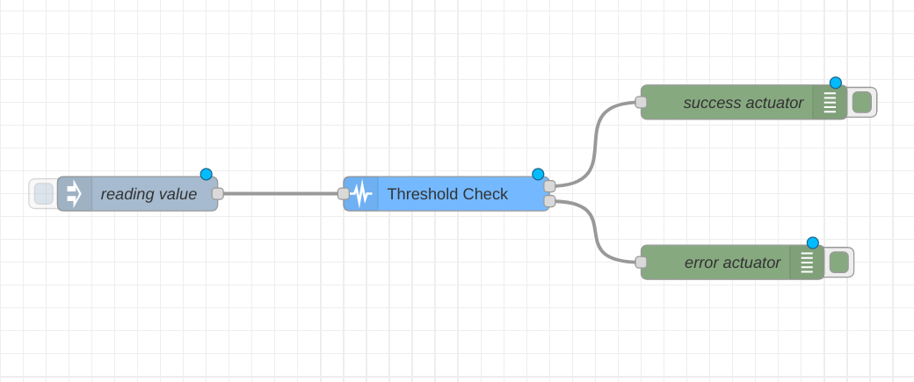

### Objectives

A node to check messages based on property values.

### Properties

<dl class="message-properties">

<dt>name: string</dt>

<dd>name of node to be displayed in editor</dd>

<dt>property</dt>

<dd>msg, flow or global property to be tested</dd>

<dt>test</dt>

<dd>test to be performed on property</dd>

<dt>fail message: string</dt>

<dd>message that describes the test that failed</dd>

</dl>

### Inputs

<dl class="message-properties">

Any

</dl>

### Outputs

<dl class="message-properties">

Input message is passed unchanged if it passed all tests.

</dl>

### Details

Node is configured with a set of rules that define the conditions for properties to be valid data. Tests are able to probe inside of objects and arrays using Javascript descriptors, including the length of strings and arrays.

When a message arrives, the selected properties are evaluated against each of the defined rules. The message is then sent to the output only if _all_ of the rules pass.

`previous value` refers to the previous value received for the tested property. `Mean` is a sliding window mean of the specified number of previous values received for the tested property.

An _assertion_ error is thrown if any rule fails. The error is attached to the original message which can be caught by a Catch node.

The `Fail Message` for the first test that failed is displayed on the node and appended to the error message.

### Example Flow

