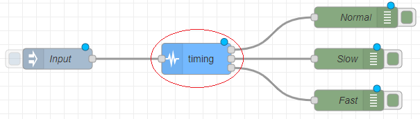

### Objective

A node that calculates the average time interval between messages and determines the flows velocity: normal, too fast or too slow, given an expected period and margin.

### Details

This node uses a sliding window of _n_ positions, which refers to the maximum number of messages it will use to calculate the average of the time intervals; when the window is full and a new message is received, the first message leaves the window and the new one is put at the end of it in order to preserve its size. Everytime a new message arrives, the average is calculated, then, if the result is greater than _Period+Margin_ the flow goes through the third output (**too slow**), if it is lesser than _Period-Margin_ the flow goes through the second output (**too fast**), else it goes through the first (**normal**).

### Setup

- Define the value for each node's properties.

### Properties

<dt>Period: integer</dt>
<dd>expected period between messages</dd>

<dt>Margin: float</dt>
<dd>fraction of Period to define an acceptance interval to be considered normal</dd>

<dt>Sliding Window Size: integer</dt>
<dd>maximum number of messages to be considered in the sliding window</dd>

### Inputs

<dl class="message-properties">Any type of message</dl>

### Outputs

<dt>Normal:</dt>
    <dd> If the period between the last message arrival and the current one falls
    between [<i>Period-Margin*Period</i>, <i>Period+Margin*Period</i>]
    seconds then the flow is normal and the message is sent through the first
    output.
  </dd>
<dt>Too slow:</dt>
    <dd> If it is greater than the stipulated period then the flow is too fast and
    the message is sent through the second output.
  </dd>
<dt>Too fast:</dt>
    <dd> If it is less than the stipulated period then the flow is too fast and the
    message is sent through the third output.
  </dd>

### Example Flow

